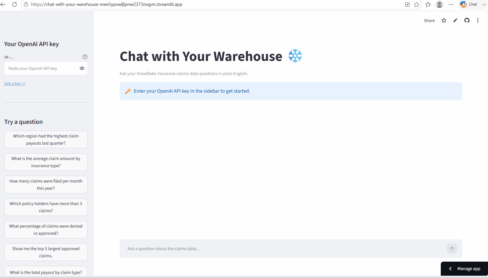
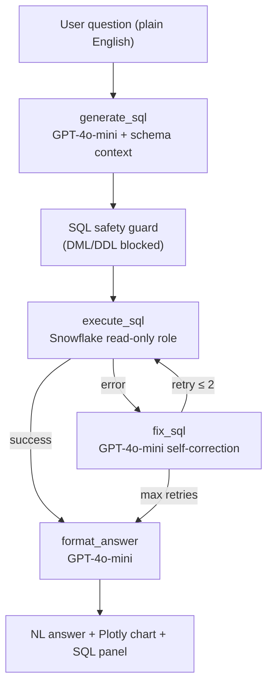

# Chat with Your Warehouse ❄️

> Ask your Snowflake insurance data questions in plain English — get answers, charts, and the SQL behind them.

**[Live demo →](https://chat-with-your-warehouse-mee5ypvwljlpme2373mqym.streamlit.app/)**



---

## What it does

You type a business question. The agent writes SQL, runs it against a real Snowflake data warehouse, self-corrects on errors, and returns a natural-language answer with an auto-generated chart — plus the raw SQL so you can audit every answer.

**Try these questions on the live demo:**
1. Which region had the highest claim payouts last quarter?
2. What is the average claim amount by insurance type?
3. How many claims were filed per month this year?
4. Which policy holders have more than 3 claims?
5. What percentage of claims were denied vs approved?
6. Show me the top 5 largest approved claims.
7. What is the total payout by claim type?

Follow-up questions work too — try *"now break that by month"* after any answer.

---

## Architecture



**Key design decisions:**
- **LangGraph explicit graph** — the pipeline is a real graph, not a chain. Each node is independently testable and the retry loop is a first-class edge, not a try/except buried in a function.
- **Schema cached once per session** — the schema description is loaded from a markdown file and cached with `st.cache_data`. It is not resent on every turn; only the last 3 conversation exchanges travel with each LLM call.
- **Read-only Snowflake role** — the app connects with a role that has only `SELECT` privileges. A regex guard additionally blocks any DML/DDL before the query reaches Snowflake.
- **User-supplied OpenAI key** — visitors paste their own `sk-...` key in the sidebar. Your Snowflake credentials stay server-side; you pay nothing for LLM calls.

---

## Stack

| Layer | Technology |
|---|---|
| UI | Streamlit + Plotly |
| Agent | LangGraph 0.2 |
| LLM | OpenAI GPT-4o-mini (via langchain-openai) |
| Warehouse | Snowflake (free trial) |
| Data | Insurance claims dataset (custom schema) |
| Deploy | Streamlit Community Cloud |

---

## Run it locally

**Prerequisites:** Python 3.11+, a Snowflake account, an OpenAI API key.

```bash
git clone https://github.com/AmbikeshMishra/chat-with-your-warehouse.git
cd chat-with-your-warehouse

python -m venv venv
# Windows:
source venv/Scripts/activate
# Mac/Linux:
source venv/bin/activate

pip install -r requirements.txt
```

Copy `.streamlit/secrets.toml.example` to `.streamlit/secrets.toml` and fill in your Snowflake credentials:

```toml
[snowflake]
account   = "your-account-identifier"   # no .snowflakecomputing.com suffix
user      = "CHAT_WH_USER"
password  = "your-password"
warehouse = "CHAT_WH"
database  = "INSURANCE_DB"
schema    = "CLAIMS"
role      = "CHAT_WH_ROLE"
```

Set up Snowflake objects by running `sql/01_setup_snowflake.sql`, `sql/02_schema_ddl.sql`, and `sql/03_load_sample_data.sql` in a Snowflake worksheet.

```bash
streamlit run streamlit_app.py
```

Open **http://localhost:8501**, paste your OpenAI API key in the sidebar, and ask a question.

---

## Hire me

I'm **Ambikesh Mishra** — a freelance AI engineer with 21 years in enterprise data (ex-Data Architect at LTI). I specialise in combining LLM agents with Snowflake, Power BI, and data warehouse systems.

If you want a production version of this — connected to your own warehouse, secured with SSO, and deployed in your cloud — let's talk.

**[LinkedIn](https://www.linkedin.com/in/ambikesh-mishra-2775b91b/)** · **m.ambikesh@gmail.com**
